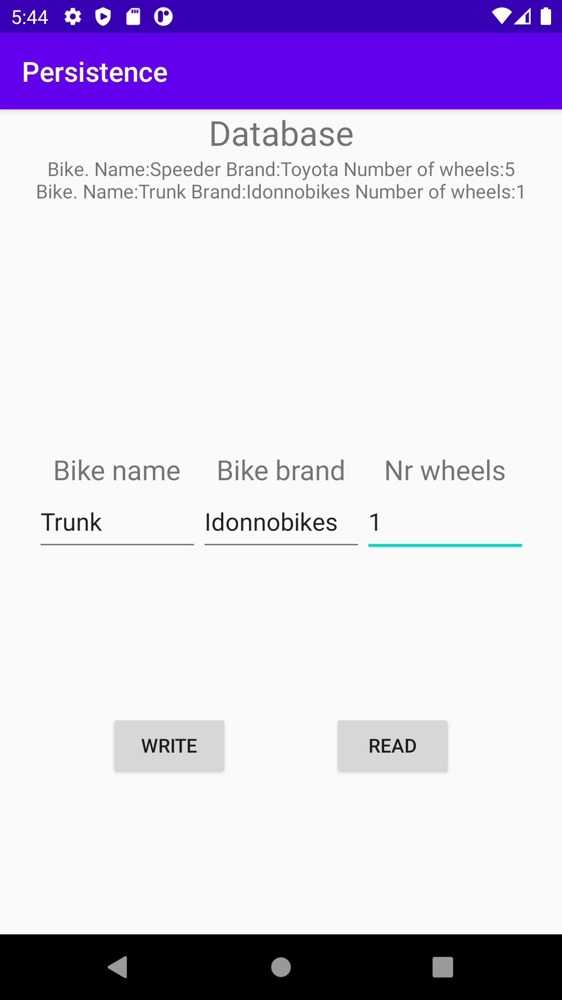

# Report

To begin the layout was designed. This included three input-fields and two buttons as well as an output text-field. As well as some other views.
After this a databasehelper was made. This accesses the database based on SQLight and on creation it makes a data-table for bikes including
the three fields given for input on the main activity. It also gives every row an id that counts upwards with every new element.

After this the functionality och the main activity was implemented. The "write" button was given an onclicklistener that when pressed would
Add the text in the input-fields to a row of the database. The "read" button on the other hand sets the text of the output-text-view
to the rows of the data-base with descriptive text in between each entry as well as a line-break after each row. Below is the code for
the "write"-button.

```
ContentValues values = new ContentValues();
values.put(DataBaseHelper.COLLUMN_NAME, String.valueOf(nameInput.getText()));
values.put(DataBaseHelper.COLLUMN_BRAND, String.valueOf(brandInput.getText()));
values.put(DataBaseHelper.COLLUMN_NR_WHEELS, String.valueOf(nrWheelsInput.getText()));
db.getWritableDatabase().insert(DataBaseHelper.TABLE_BIKE, null, values);
```

